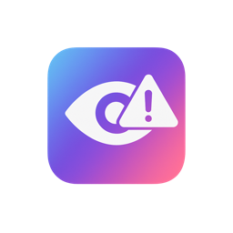

<p align="center">
  
</p>

<h1 align="center">Blurry</h1>

<p align="center">
  A macOS menu bar utility for creating blur, darken, or picture overlay effects on specific screen areas.
</p>

<p align="center">
  <a href="https://github.com/twttr/blurry/actions/workflows/ci.yml"></a>
  
  
  
</p>

## Features

- **Multiple Effect Types**: Choose from blur, darken, or picture overlays
- **Persistent Overlays**: Effects persist across all Spaces and Desktops
- **Multi-Display Support**: Works seamlessly with multiple monitors
- **Hover Detection**: Optional "disable on hover" feature to temporarily hide overlays
- **Global Hotkey**: Toggle all areas with `Cmd+Shift+B`
- **Menu Bar App**: Runs as an accessory application (no dock icon)

## Installation

### Homebrew

```bash
brew tap twttr/apps
brew install --cask blurry
```

### Build from Source

1. Clone the repository:
   ```bash
   git clone https://github.com/twttr/blurry.git
   cd blurry
   ```

2. Open in Xcode:
   ```bash
   open Blurry.xcodeproj
   ```

3. Build and run with `Cmd+R`

### Requirements

- macOS 12.0 or later
- Xcode 14.0 or later

## Usage

1. Click the Blurry icon in your menu bar
2. Select an effect type (Blur, Darken, or Picture)
3. Draw a rectangle on screen to define the area
4. Name your area and adjust settings as needed

### Keyboard Shortcuts

| Shortcut | Action |
|----------|--------|
| `Cmd+Shift+B` | Toggle all areas on/off |

## License

This project is licensed under the MIT License - see the [LICENSE](LICENSE) file for details.
